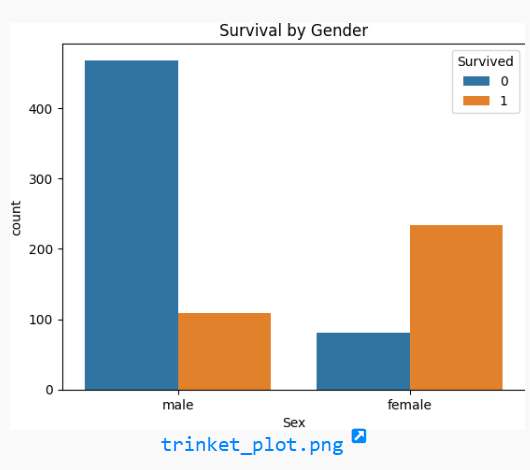

# 🚢 Titanic Dataset - Data Cleaning & EDA

This project focuses on **data cleaning** and **exploratory data analysis (EDA)** using the famous Titanic dataset from Kaggle. The goal is to uncover patterns and relationships in the data that influenced passenger survival.

---

## 📊 Task Overview

> **Task:**  
Perform data cleaning and EDA on a dataset (Titanic) to explore relationships between variables and identify patterns and trends in the data.

---

## 🧹 Data Cleaning Steps

- ✅ Removed duplicate entries  
- ✅ Dropped the `Cabin` column due to many missing values  
- ✅ Filled missing `Age` values with the **median**  
- ✅ Filled missing `Embarked` values with the **mode**  
- ✅ Rechecked for nulls after cleaning

---

## 📈 EDA Highlights

- Analyzed **survival rates** by:
  - Gender (`Sex`)
  - Passenger class (`Pclass`)
  - Age groups
  - Fare
  - Family size
  - Embarkation point (`Embarked`)
  
- Visualized key patterns using `Seaborn` and `Matplotlib`.

---

## 🔍 Key Insights

| Feature   | Observation                              |
|-----------|-------------------------------------------|
| **Sex**   | Females had a much higher survival rate   |
| **Pclass**| Higher-class passengers survived more     |
| **Age**   | Children had a better chance of survival  |
| **Fare**  | Higher fare correlated with higher survival |
| **Embarked** | Port C had better survival outcomes   |

---

## 🛠 Technologies Used

- Python
- Pandas
- Matplotlib
- Seaborn
- trinket
---
## 📁 Dataset

Titanic Dataset from Kaggle:  
🔗 [https://www.kaggle.com/c/titanic/data](https://www.kaggle.com/c/titanic/data)

---
## 📷 Sample Output

---

## ✅ Project Status

> **Status:** Task Completed  
The dataset is cleaned, EDA performed, and key patterns have been visualized and summarized.
---
Feel free to reach out via [LinkedIn](https://www.linkedin.com/in/kolachana-praneesh-618a05291/)
